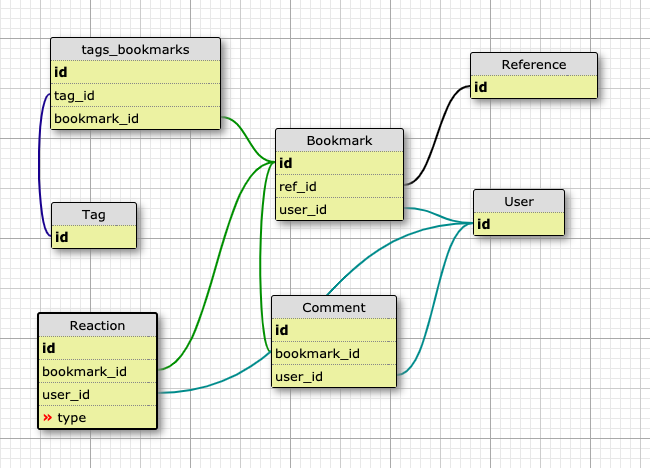

# SOSOG
Reference information sharing system

Standing on the shoulders of Giants (SOSOG).

## Install

    conda install -c anaconda flask
    conda install -c conda-forge flask-debugtoolbar
    conda install -c conda-forge flask-sqlalchemy
    # for tests
    conda install -c anaconda nose

## Create database

    $ python
    >>> from app import db
    >>> db.create_all()

## Run app

    export FLASK_APP=app.py
    export FLASK_DEBUG=1
    flask run 
    # and then, access http://localhost:5000/

## Test

    python tests/preparedb.py
    nosetests -v
    test_bookmark (test_model.TestBookmark) ... ok
    test_new_tag (test_model.TestNewTag) ... ok
    test_reference_add (test_model.TestReference) ... ok
    test_add_tag (test_model.TestTagRelationship) ... ok
    test_adduser (test_model.TestUser) ... ok
    
    ----------------------------------------------------------------------
    Ran 5 tests in 0.460s
    
    OK

## Schema (2019.04.29)

